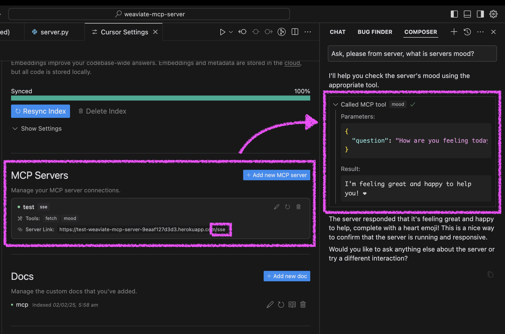

# MCP Server Template for Cursor IDE

A simple template for creating custom tools for Cursor IDE using Model Context Protocol (MCP). Create your own repository from this template, modify the tools, and connect them to your Cursor IDE.



## Quick Start

1. Click "Deploy to Heroku" button

    [](https://heroku.com/deploy?template=https://github.com/kirill-markin/weaviate-mcp-server)

2. After deployment, configure Cursor:
   - Open Cursor Settings → Features
   - Add new MCP server
   - Use your Heroku URL with `/sse` path (e.g., `https://<your-app-name>.herokuapp.com/sse`)

3. Test your agent's mood in Cursor:
   - Ask your agent "Please ask about our server mood and let me know how it is."
   - The server will respond with a cheerful message and a heart ❤️

## Alternative Setup Methods

You can run the server in three ways: using Docker, traditional Python setup, or directly in Cursor IDE.

### Docker Setup

The project includes Docker support for easy deployment:

1. Initial setup:
```bash
# Clone the repository
git clone https://github.com/kirill-markin/weaviate-mcp-server.git
cd weaviate-mcp-server

# Create environment file
cp .env.example .env
```

2. Build and run using Docker Compose:
```bash
# Build and start the server
docker compose up --build -d

# View logs
docker compose logs -f

# Check server status
docker compose ps

# Stop the server
docker compose down
```

3. The server will be available at:
   - SSE endpoint: http://localhost:8000/sse

4. Quick test:
```bash
# Test the server endpoint
curl -i http://localhost:8000/sse
```

5. Connect to Cursor IDE:
   - Open Cursor Settings → Features
   - Add new MCP server
   - Type: Select "sse"
   - URL: Enter `http://localhost:8000/sse`

### Traditional Setup

First, install the uv package manager:

```bash
# Install uv on macOS
brew install uv
# Or install via pip (any OS)
pip install uv
```

Start the server using either stdio (default) or SSE transport:

```bash
# Install the package with development dependencies
uv pip install -e ".[dev]"

# Using stdio transport (default)
uv run mcp-simple-tool

# Using SSE transport on custom port
uv run mcp-simple-tool --transport sse --port 8000

# Run tests
uv run pytest -v
```

After installation, you can connect the server directly to Cursor IDE:

1. Right-click on the `cursor-run-mcp-server.sh` file in Cursor
2. Select "Copy Path" to copy the absolute path
3. Open Cursor Settings (gear icon)
4. Navigate to Features tab
5. Scroll down to "MCP Servers"
6. Click "Add new MCP server"
7. Fill in the form:
   - Name: Choose any name (e.g., "my-mcp-server-1")
   - Type: Select "stdio" (not "sse" because we run the server locally)
   - Command: Paste the absolute path to `cursor-run-mcp-server.sh` that you copied earlier. For example: `/Users/kirillmarkin/weaviate-mcp-server/cursor-run-mcp-server.sh`

### Environment Variables

Available environment variables (can be set in `.env`):

- `MCP_SERVER_PORT` (default: 8000) - Port to run the server on
- `MCP_SERVER_HOST` (default: 0.0.0.0) - Host to bind the server to
- `DEBUG` (default: false) - Enable debug mode
- `MCP_USER_AGENT` - Custom User-Agent for website fetching

## Additional options

### Installing via Smithery

[](https://smithery.ai/server/@kirill-markin/example-mcp-server)

To install MCP Server Template for Cursor IDE for Claude Desktop automatically via [Smithery](https://smithery.ai/server/@kirill-markin/example-mcp-server):

```bash
npx -y @smithery/cli install @kirill-markin/example-mcp-server --client claude
```

### Glama server review

<a href="https://glama.ai/mcp/servers/jgisqn8zco"></a>

